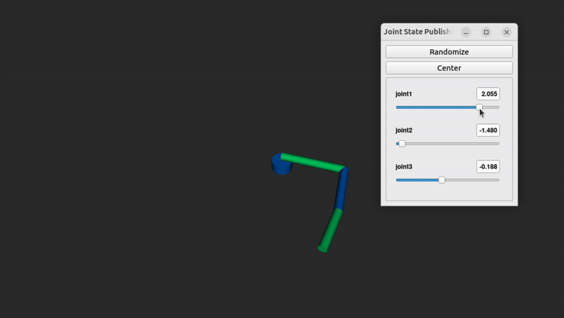

# ROS2 Basic Arm

A minimal ROS 2 Humble teaching project that shows a three‑joint cylindrical arm in RViz and lets you pose it with slider controls.



---

## Features

* **URDF Xacro** description with clear parameter names
* Launch file that brings up `robot_state_publisher`, a GUI for joint states, and RViz in one command
* Works entirely in simulation

---

## Prerequisites

* Ubuntu 22.04 with ROS 2 Humble installed
* Packages

  ```bash
  sudo apt update
  sudo apt install \
       ros-humble-xacro \
       ros-humble-joint-state-publisher \
       ros-humble-joint-state-publisher-gui \
       ros-humble-rviz2
  ```

---

## Quick start

```bash
# clone the repo
cd ~/ros2_ws/src
git clone https://github.com/Girish-Krishnan/ROS2-Basic-Arm.git

# build and source
cd ~/ros2_ws
colcon build --symlink-install
source install/setup.bash

# run everything
ros2 launch my_simple_arm display.launch.py
```

* A slider window titled **joint\_state\_publisher\_gui** appears
* RViz opens with the arm already visible
* Drag the sliders and watch the arm animate in real time

---

## Repository layout

```
ros2_ws/
└── src/
    └── my_simple_arm/
        ├── launch/            # display.launch.py
        ├── rviz/              # arm.rviz config file
        ├── urdf/              # simple_arm.urdf.xacro
        ├── my_simple_arm/     # Python package marker
        ├── package.xml
        └── setup.py
```

The workspace keeps **build install log** out of version control via `.gitignore`.

---

## Editing the arm

* Change link lengths or colors by editing `urdf/simple_arm.urdf.xacro`
* Add meshes instead of cylinders by replacing each `<geometry>` block
* Update joint limits or axes as you teach more concepts

Rebuild with `colcon build`, then relaunch to see changes.

---

## Continuous integration

The repository includes a GitHub Actions workflow that builds the package on every push.  It verifies syntax and confirms that the launch file still works.

---

## License

This project is licensed under the MIT License.  See `LICENSE` for details.
